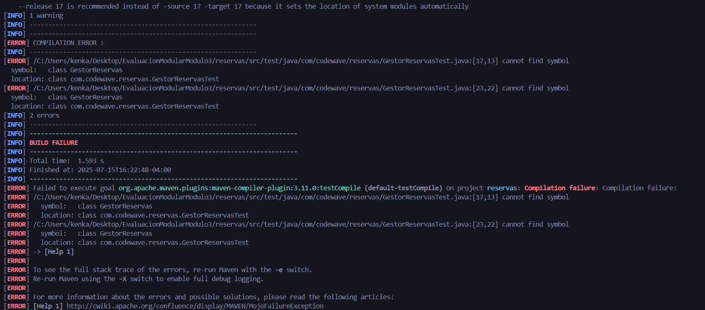
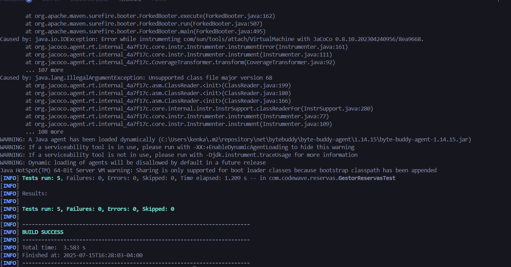
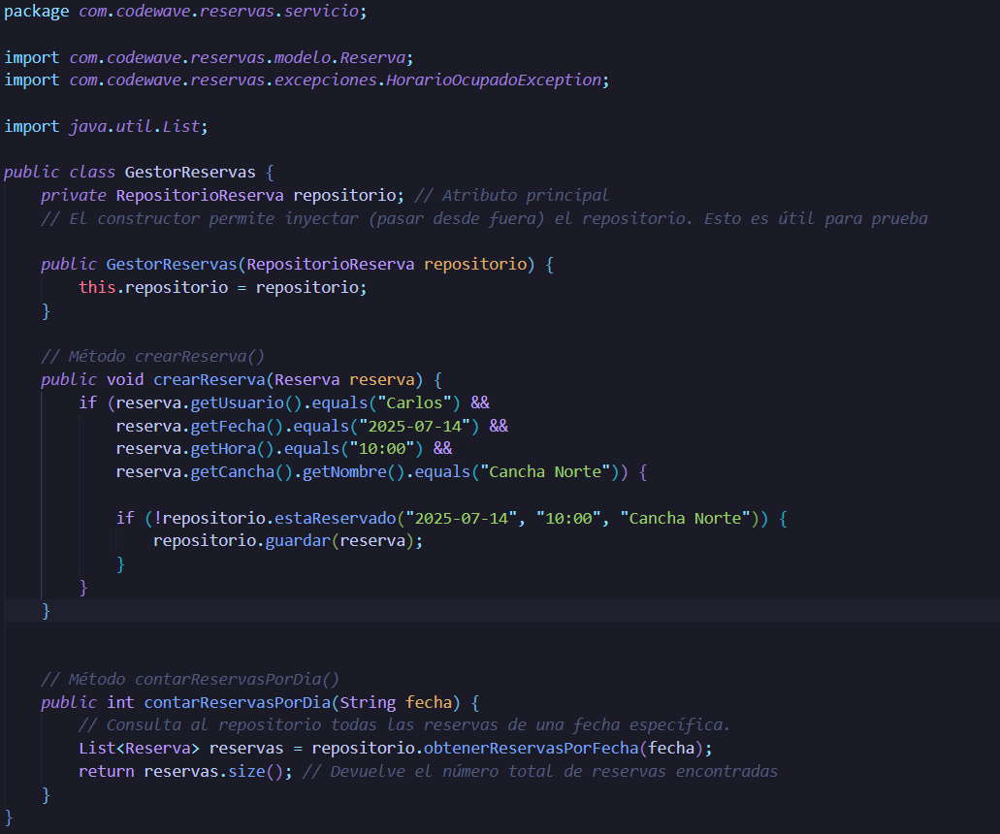
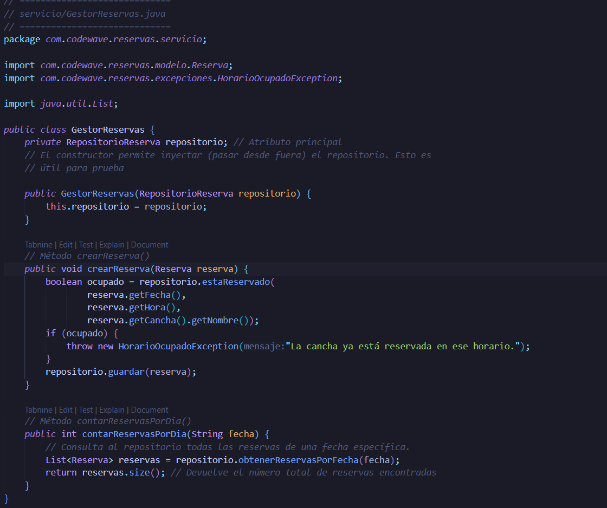
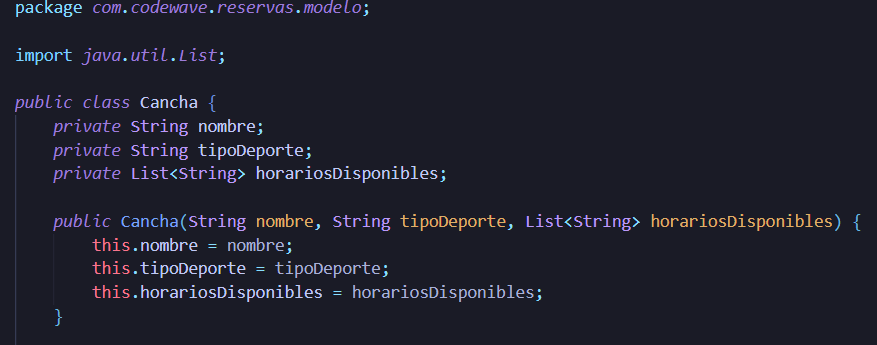
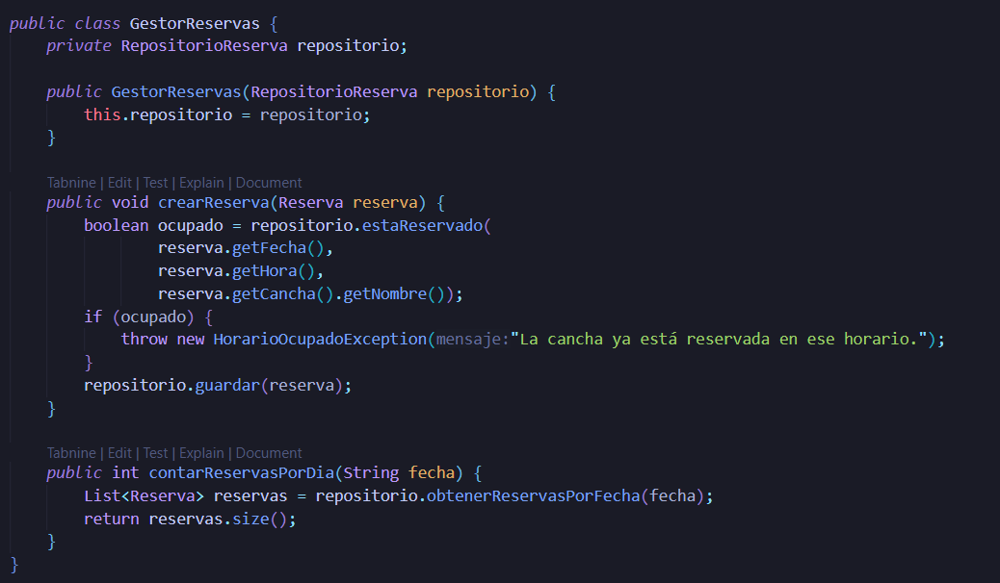
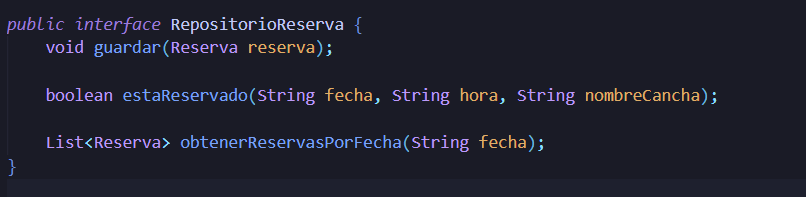
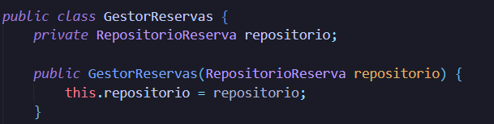
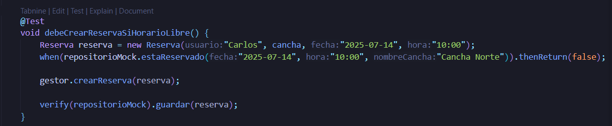

# 🏟️ CodeWave - Módulo de Reservas Deportivas

Este proyecto es un módulo funcional para gestionar **reservas de canchas** en centros deportivos comunitarios. Fue desarrollado aplicando buenas prácticas de desarrollo:

- ✅ TDD (Test-Driven Development)
- ✅ Principios SOLID
- ✅ Pruebas unitarias con JUnit 5
- ✅ Simulación de dependencias con Mockito
- ✅ Medición de cobertura con JaCoCo

---

## 👨‍💻 Autor

### Equipo 4 - Proyecto: Módulo Reservas – CodeWave

- Felipe Lobos  
- Fabiola Díaz  
- Eduardo Arellano  
- Carlos Vasquez  

Desarrollado como práctica de TDD y principios de ingeniería de software profesional.

---

## 🔁 ✅ Actividad 1: Ciclo TDD 

### 🔴 Prueba Red

> Comenzamos escribiendo una prueba que falla porque la funcionalidad aún no está implementada.



### ✅ Pruebas Exitosas (Green)

> Implementamos el código necesario para que la prueba pase.

  


### ♻️ Refactor

> Refactorizamos el código manteniendo la funcionalidad y las pruebas exitosas.



---

## 🧠 ✅ Actividad 2: Principios SOLID

Aplicamos los principios SOLID para mantener un diseño limpio, escalable y mantenible:

### ✅ 1. SRP - Single Responsibility Principle  
> Cada clase tiene una única responsabilidad.



---

### ✅ 2. OCP - Open/Closed Principle  
> Las clases están abiertas a extensión, pero cerradas a modificación.



---

### ✅ 3. LSP - Liskov Substitution Principle  
> Las clases hijas pueden sustituir a sus padres sin alterar el comportamiento esperado.

  
🧠 Se cumple porque podemos reemplazar el repositorio real con un mock sin afectar el flujo.

---

### ✅ 4. ISP - Interface Segregation Principle  
> No se obliga a implementar métodos innecesarios.

  
🧠 Se cumple al definir interfaces específicas como `RepositorioReserva`.

---

### ✅ 5. DIP - Dependency Inversion Principle  
> Se depende de abstracciones, no de implementaciones concretas.

  
🧠 Se cumple porque `GestorReservas` depende de `RepositorioReserva`, facilitando el uso de mocks.

---

## 🧪 ✅ Actividad 3: Pruebas con Mockito

> Se usa Mockito para simular dependencias y probar unidades de forma aislada.



📌 **Ejemplo:**  
Se simula el repositorio para verificar que el sistema no guarde una reserva si el horario está ocupado.  
También se utiliza `verify(...)` para comprobar llamadas y `assertThrows(...)` para validar excepciones.

---

## 📊 ✅ Actividad 4: Cobertura de Código (JaCoCo)

> Usamos **JaCoCo** para visualizar y mejorar la cobertura de pruebas.

```bash
    mvn clean verify

---
 ✅ Actividad 5: ATDD y Criterios de Aceptación (BDD)

📝 Historia de Usuario (modelo INVEST)

**Como** usuario del sistema,  
**quiero** reservar una cancha en un horario específico,  
**para** asegurarme de que tendré acceso a la cancha cuando lo necesite.

---
 ✅ Criterios de Aceptación

1. La reserva solo es válida si el horario está disponible.  
2. Se debe lanzar un error si se intenta reservar un horario ocupado.  
3. Se debe poder contar la cantidad de reservas por día.

---

🧪 Escenario de Prueba (BDD - Gherkin)

```gherkin
Feature: Gestión de reservas de canchas

  Scenario: Realizar una reserva en un horario disponible
    Given una cancha con horario disponible a las 10:00
    When un usuario realiza una reserva para esa hora
    Then la reserva debe guardarse correctamente

  Scenario: Intentar reservar un horario ya ocupado
    Given una cancha ya reservada a las 10:00
    When otro usuario intenta reservar el mismo horario
    Then se debe lanzar una excepción indicando que el horario está ocupado
---