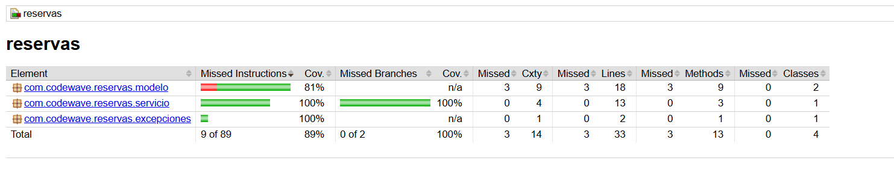

# 🏟️ CodeWave - Módulo de Reservas Deportivas

Este proyecto es un módulo funcional para gestionar **reservas de canchas** en centros deportivos comunitarios. Fue desarrollado aplicando:

- ✅ TDD (Test-Driven Development)
- ✅ Diseño SOLID
- ✅ Pruebas unitarias con JUnit 5
- ✅ Simulación de dependencias con Mockito
- ✅ Medición de cobertura de código con JaCoCo

👨‍💻 Autor
Carlos Vásquez
Proyecto: Módulo Reservas – CodeWave
Desarrollado para práctica de TDD y buenas prácticas de la industria.
 
## 🧪 Pruebas Exitosas


---

## 📊 Cobertura de Código (JaCoCo)



---

## 🧠 Diseño SOLID y Clases
✅ 1. S — Single Responsibility Principle (SRP)
# Una clase debe tener una única responsabilidad.


✅ 2. O — Open/Closed Principle (OCP)
# Una clase debe estar abierta a extensión, pero cerrada a modificación.


✅ 3. L — Liskov Substitution Principle (LSP)
# Una clase hija debe poder sustituir a su clase padre o interfaz sin romper el sistema.

# 🧠 Cumple LSP porque puedes reemplazar cualquier implementación sin que el resto del sistema falle.

✅ 4. I — Interface Segregation Principle (ISP)
# No forzar a clases a depender de métodos que no usan.

# 🧠 Cumple ISP porque solo expone lo necesario para las reservas. No hay métodos inútiles como eliminarTodo() o reset() que otras clases deban implementar a la fuerza.

✅ 5. D — Dependency Inversion Principle (DIP)
# Depender de abstracciones, no de clases concretas.

# 🧠 Cumple DIP porque GestorReservas no depende de un repositorio físico específico (ni base de datos, ni archivo), sino de una abstracción (interfaz) que se puede cambiar fácilmente (usamos Mockito en los tests).
---

## 🧪 Test con Mockito


# Aqui se Declara


---

## 📦 Estructura del Proyecto

src/
├── main/
│ └── java/com/codewave/reservas/
│ ├── modelo/
│ │ ├── Cancha.java
│ │ └── Reserva.java
│ ├── servicio/
│ │ ├── GestorReservas.java
│ │ └── RepositorioReserva.java
│ └── excepciones/
│ └── HorarioOcupadoException.java
└── test/
└── java/com/codewave/reservas/
└── GestorReservasTest.java


---

## ⚙️ Tecnologías Usadas

| Tecnología | Descripción |
|------------|-------------|
| Java 17 | Lenguaje principal |
| JUnit 5 | Pruebas unitarias |
| Mockito | Mocks para pruebas |
| JaCoCo | Cobertura de pruebas |
| Maven | Gestor de dependencias y build |

---

## 🚀 Cómo Ejecutar el Proyecto

1. Clona el repositorio:

   ```bash
   git clone https://github.com/tuusuario/modulo-reservas.git
   cd modulo-reservas

2. Compila y ejecuta las pruebas con cobertura:
    ```bash    
    mvn clean verify

3. Windows:
    ```bash  
    open target/site/jacoco/index.html

